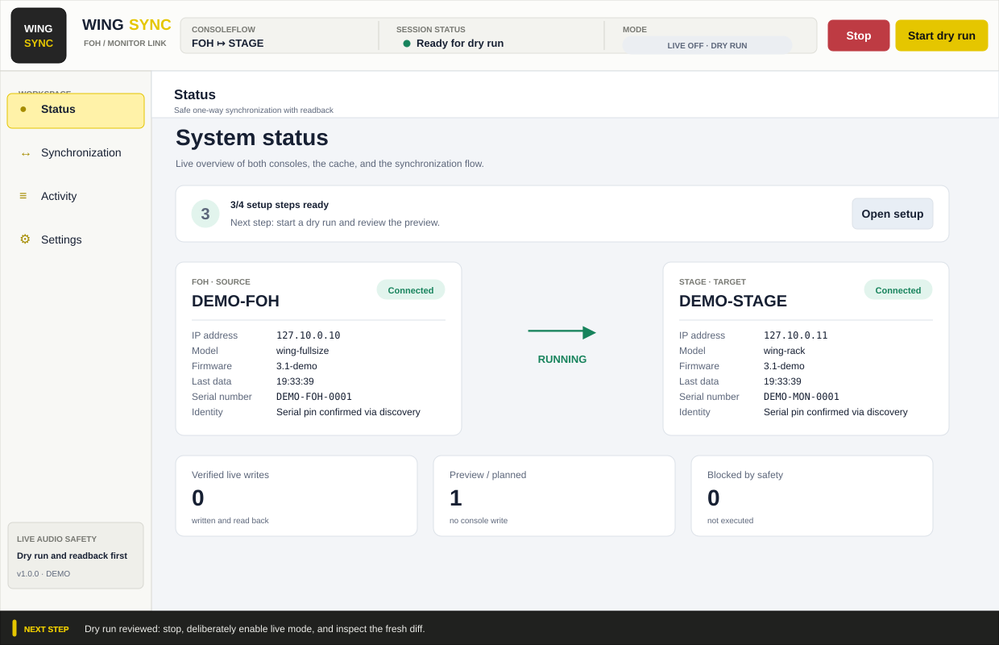
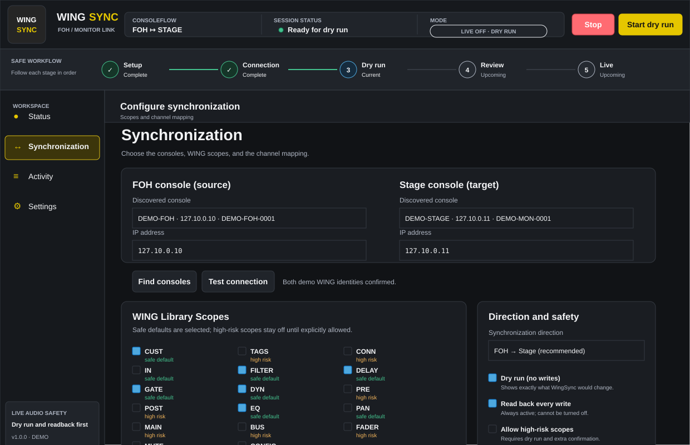
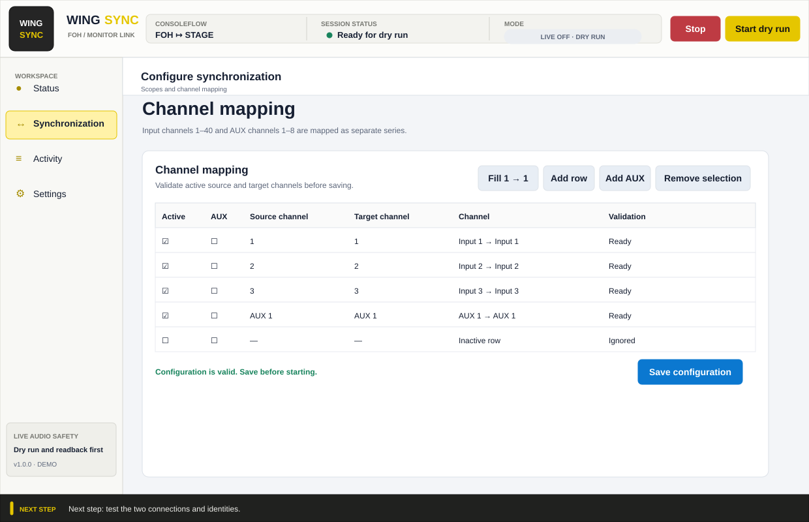
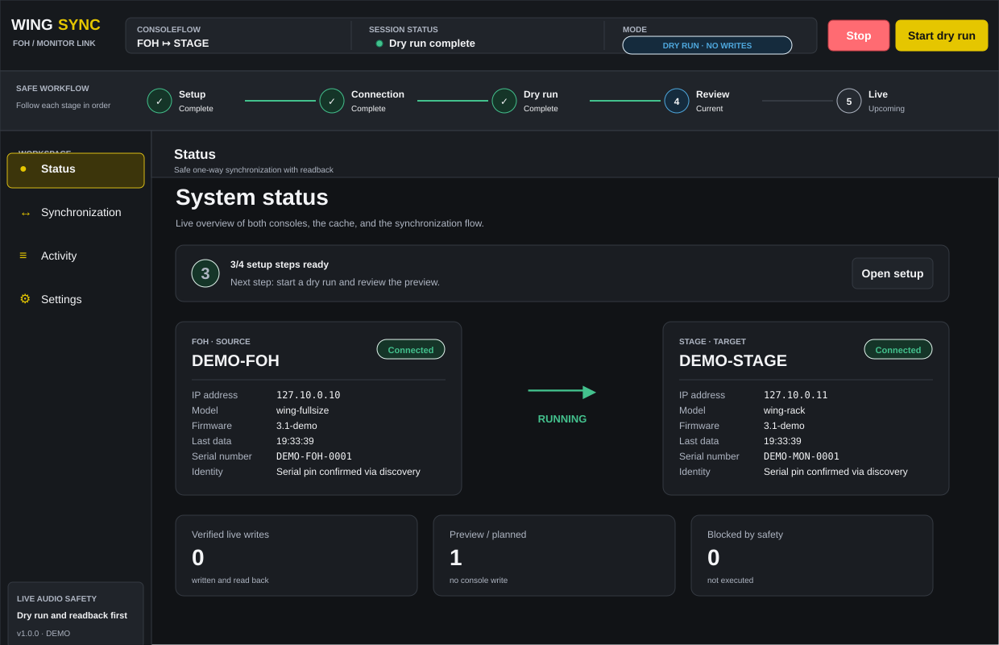
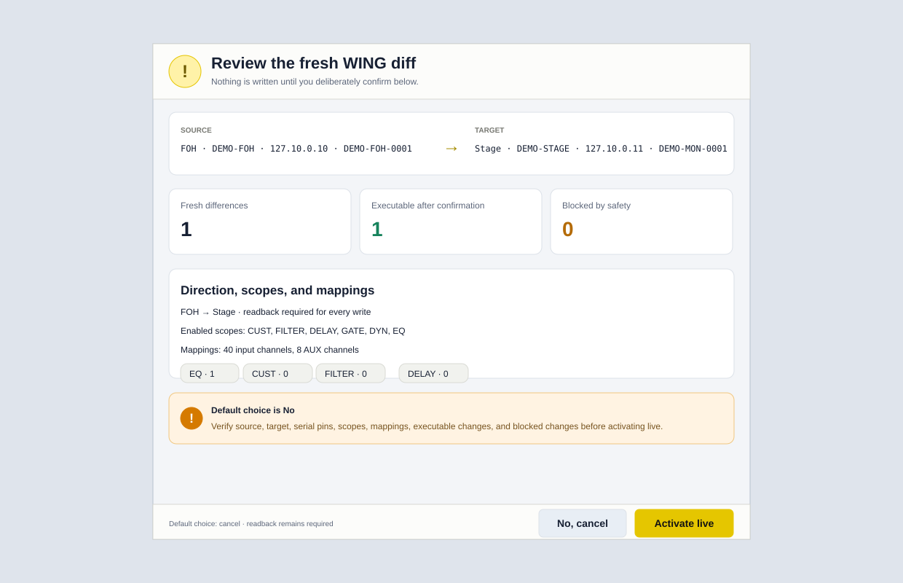
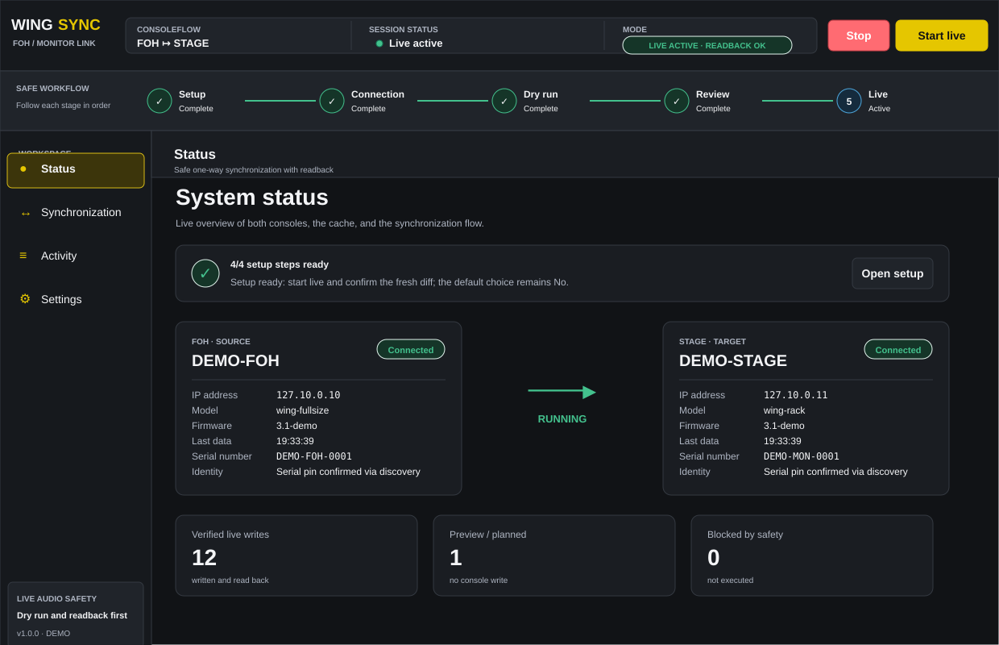
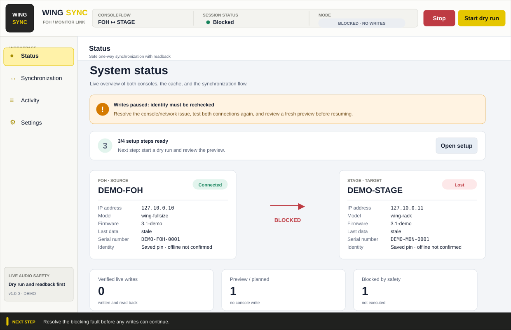
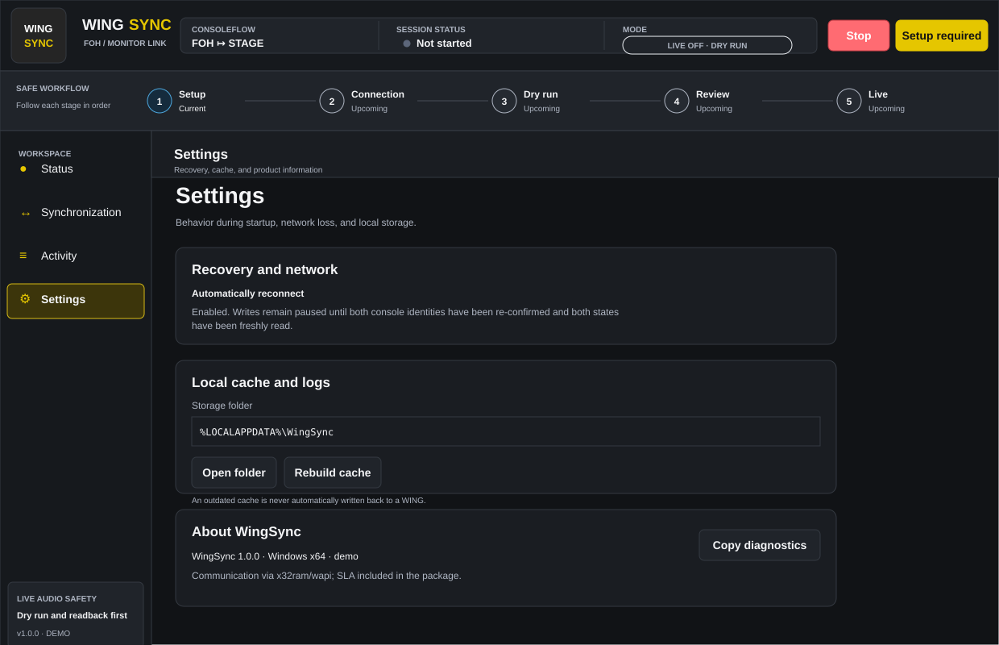
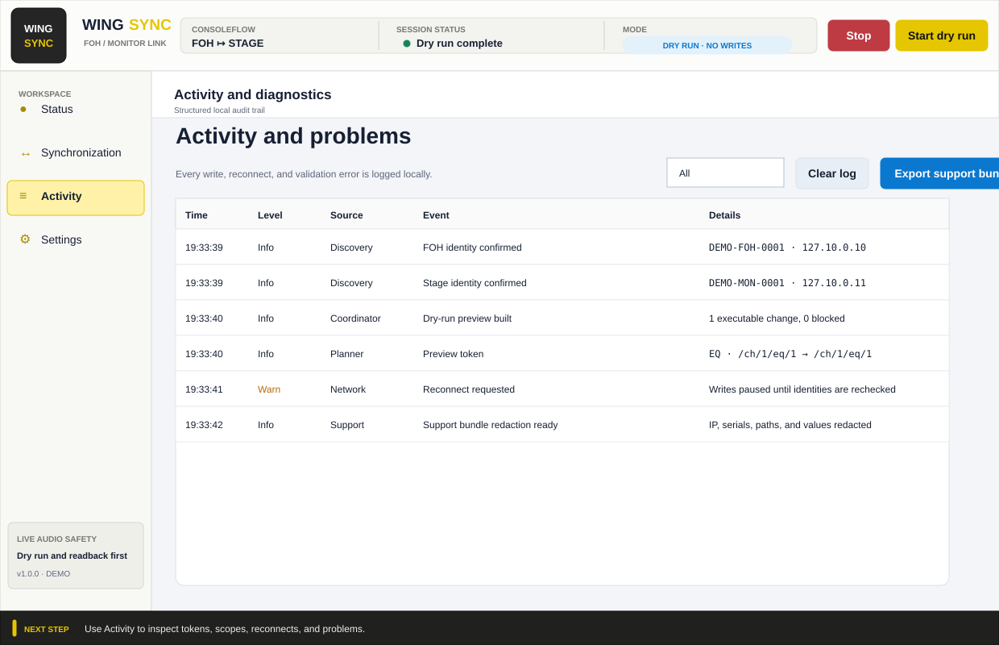

# WingSync user guide

WingSync follows a live-audio workflow: first verify identity and direction,
then review a dry run, and only then deliberately enable live mode. The
default choice in a live confirmation is always **No**.

> **Current release boundary:** identity, read-only, and bounded physical
> write/readback/recovery tests have passed. Physical cable interruption,
> event-storm measurement, and endurance testing are not finished yet. The
> portable build is also not Authenticode-signed. Therefore, do not use live
> synchronization during a show yet; dry run and demo mode are suitable for
> preparation and review.

## Preparation

1. Create an up-to-date show backup on both WINGs.
2. Connect the Windows PC and the control ports of both consoles to the same
   isolated IPv4 control network.
3. Allow UDP and TCP port 2222 for WingSync and `WingSync.WapiHost.exe`. A
   different WAPI port is not supported.
4. Start `WingSync.exe`. The app starts with **Dry run (no writes)** enabled.
5. Always check the direction, session status, and mode in the top bar before
   performing an action.

Final automation was performed on Windows x64 build 26200. The app is
self-contained; older Windows builds were not validated in this acceptance
round.

For training without hardware:

```powershell
.\scripts\run.ps1 -Demo
```

## Simple setup in four steps

The **Status** page shows a checklist and always the next safe action.



### 1. Find consoles and pin identity

Open **Synchronization** and choose **Find consoles**. Assign one physical
console to FOH and the other to stage. Check in the selection list and on the
two status cards:

- console name and role;
- IP address;
- model and firmware;
- full serial number;
- the labels **SOURCE** and **TARGET**.

A visible serial number is a hardware pin, not just descriptive information.
Live use remains blocked when a serial is missing, when the same serial number
is selected for both roles, or when IP and serial no longer match during a
later check.

The recommended direction is **FOH → Stage**. **Stage → FOH** is supported,
but deliberately shows a warning. There is no bidirectional mode.



### 2. Choose scopes and channel mapping

Choose only the global WING sections required for this workflow:

| UI scope | Contents | Safe default |
|---|---|---:|
| `CUST` | name, color, icon, and light | on |
| `TAGS` | tags and DCA/mute assignments | off, high risk |
| `CONN` | source A/B and input selection | off, high risk |
| `IN` | trim, balance, and phase; no physical preamp or phantom | off |
| `FILTER` | HPF, LPF, tilt, and all-pass | on |
| `DELAY` | input delay | on |
| `GATE` | gate, model, and sidechain | on |
| `DYN` | dynamics, model, crossover, and sidechain | on |
| `PRE` | pre-insert assignment | off, high risk |
| `POST` | post-insert assignment | off, high risk |
| `EQ` | channel and pre-send EQ | on |
| `PAN` | pan and width | off |
| `MAIN` | Main 1–4 assignment and levels | off, high risk |
| `BUS` | bus and matrix sends | off, high risk |
| `FADER` | channel fader | off, high risk |
| `MUTE` | channel mute | off, high risk |
| `CONFIG` | process order, tap, solo-safe, and monitor configuration | off, high risk |

`MAIN`, `BUS`, and `FADER` are the global names the operator sees in the UI.
Internally, `MAIN` maps to Main 1–4, `BUS` to WAPI section `SEND`, and
`FADER` to `FDR`.

Then fill in the mapping:

- input channels range from 1–40;
- AUX channels range from 1–8 and form a separate series;
- each active source channel and each active target channel may appear only
  once per series;
- entering **1 → 1** first asks for confirmation with default choice **No**
  when the list was customized, and after **Yes** replaces the list; review it
  immediately;
- an unresolvable sidechain reference blocks the entire affected gate or
  dynamics processor group.



**Save configuration** writes the configuration atomically to the local data
folder. Validation errors are shown together below the mapping; resolve all of
them before you start.

### 3. Test both connections

Choose **Test connection**. WingSync checks for both roles:

- the discovered IP/serial combination;
- that FOH and stage are different physical consoles;
- an individual WAPI connection;
- keepalive/status readback.

The cards show when real data was last read for each console. A discovery time
or a local cache does not count as a successful connection test.

### 4. Run dry run and review the preview

Leave **Dry run (no writes)** enabled and choose **Start dry run**. WingSync
reads both consoles fresh, builds the mapping diff, and logs what would
happen. In this mode no parameter write is sent to any console.

On **Status**, review three separate counters:

- **Preview / planned**: differences calculated without writing to a console;
- **Verified live writes**: only writes actually executed whose readback
  matched;
- **Blocked**: differences that could not be executed because of scope,
  mapping, or safety rules.

Use **Activity** to inspect the exact tokens, scopes, reconnects, and
problems. Stop after the review. The checklist then shows the safe transition
to live mode.



## From dry run to live

Perform this procedure only in a maintenance window:

1. Re-check the backups, direction, visible serial numbers, scopes, and
   mapping.
2. Stop the dry run.
3. Disable **Dry run (no writes)**. Readback for every write is always enabled
   and cannot be turned off.
4. Enable **Allow high-risk scopes** only when the selected tags, routing,
   inserts, mains, sends, faders, mutes, or configuration are truly allowed to
   change live.
5. Choose **Start live**. During connect, snapshots, and the preview the mode
   is **PREPARING · NO WRITES**.
6. In the confirmation, verify source and target IP, both serial pins,
   direction, scopes, mapping count, executable changes, blocked changes, and
   the breakdown per scope. Only then choose **Yes**.
7. For selected high-risk scopes, a second separate confirmation of the show
   backups follows.
8. After **Yes**, WingSync shows **APPLYING LIVE · WRITES + READBACK** during
   the initial apply. In that phase, confirmed writes and their required
   readback are active. Only after successful completion does
   **LIVE ACTIVE · READBACK OK** appear.





If you change a console, IP, direction, scope, or mapping, WingSync revokes
live and high-risk approval, switches back to dry run, and invalidates the
connection test. Repeat from the relevant setup step.

Use the red **Stop** button or `Ctrl+Shift+S` as an emergency stop. This blocks
new and not-yet-sent writes immediately. A WAPI write that has already been
sent to the console may only finish its bounded transaction/readback safely
before the sessions are disconnected. If there is immediate audio risk, also
take the normal physical audio measures; do not wait for software status
alone.

## Status and faults

- **LIVE OFF · DRY RUN**: safely prepared; no writes are performed.
- **DRY RUN · NO WRITES**: snapshots and previews may run.
- **PREPARING · NO WRITES**: live has been requested, but not yet confirmed.
- **APPLYING LIVE · WRITES + READBACK**: the confirmed initial diff or
  reconnect catch-up is being written and each batch is read back.
- **LIVE ACTIVE · READBACK OK**: the live engine is running and executed
  writes are read back.
- **LIVE PAUSED · NO WRITES** or **BLOCKED · NO WRITES**: there is no
  permission to continue writing.

The colors support that text:

- green: demonstrably active and verified live operation;
- blue: dry run;
- yellow/orange: preparation, reconnect, or warning;
- red: blocking fault or stop action;
- gray: off/offline.

If one console is lost, identity changes, a queue overflow occurs, the helper
fails, or readback fails, WingSync pauses writes. After reconnect, identity
and both states are read again and a new diff is built. An error banner gives
the cause and recovery action; do not resume until the cause is resolved and
the new preview has been reviewed.



## Local cache

WingSync stores the last observed state per console under
`%LOCALAPPDATA%\WingSync\cache`. The status cards show, for FOH and stage, the
number of local values, their age, and whether a backup was restored.

The cache is only for offline display and diagnostics:

- it does not replace a live identity or connection test;
- it is not used as a source for a synchronization plan;
- it is never replayed after reconnect;
- a serial, firmware, or schema mismatch marks the cache stale or isolates it;
- a damaged file is isolated instead of being loaded blindly.

Under **Settings → Rebuild cache** you can reset the cache after stopping. The
previous cache is kept in a dated quarantine folder.



## Activity, logs, and support bundle

The **Activity** page can filter by all, problems, writes, and network.
**Clear** removes only the in-memory list; local JSONL log files are kept.



**Export support bundle** asks for permission first and creates a zip under
`%LOCALAPPDATA%\WingSync\support` containing:

- a redacted configuration structure;
- redacted JSONL log events;
- product version, coordinator status, and dropped-log counter.

IP addresses, serial numbers, local user paths, and WING parameter values are
always redacted. Cache files and console snapshots are not included. Also
review a redacted bundle before sharing it externally.

## Keyboard shortcuts

- `Ctrl+1`: Status
- `Ctrl+2`: Synchronization
- `Ctrl+3`: Activity
- `Ctrl+4`: Settings
- `Ctrl+Shift+S`: stop synchronization immediately

The editor is locked during an active session. Stop first before changing
topology or safety settings.
